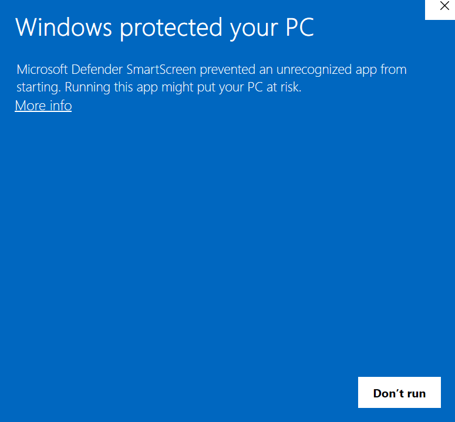
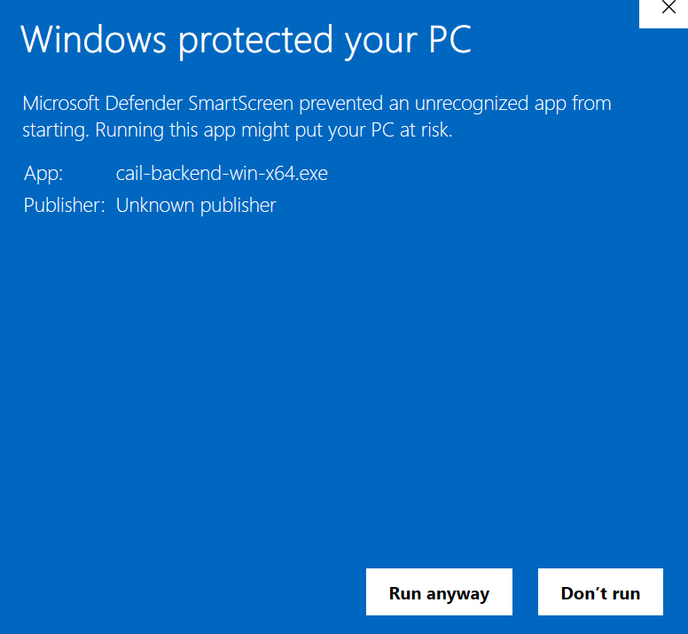
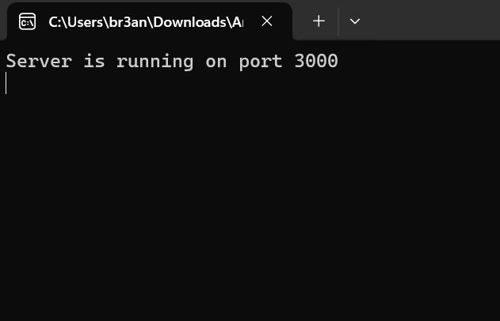
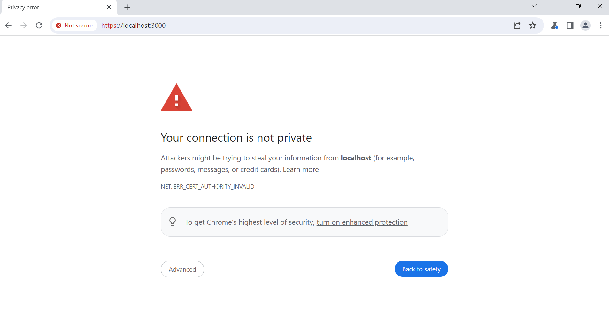
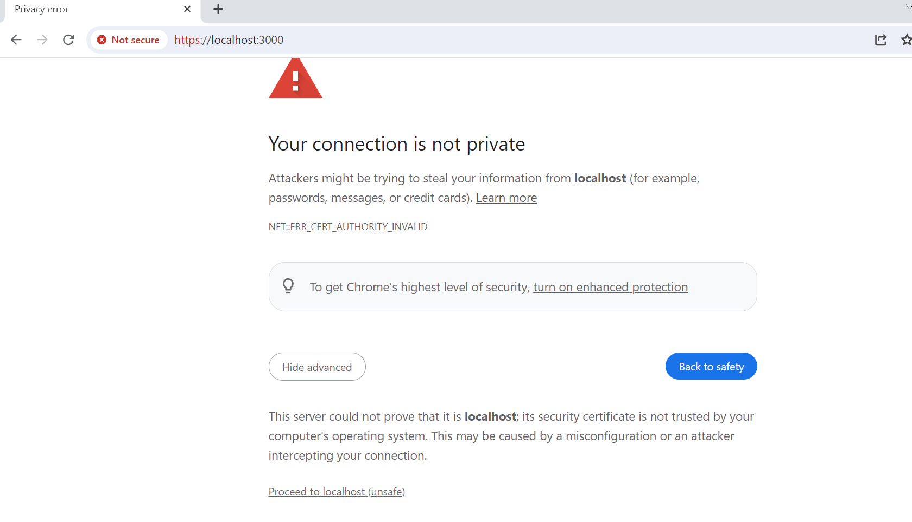

# Install on Windows

1. Download the archive: https://github.com/disha-cha/CAILA/releases/download/Win-v1.0.0/v1.0.0-Windows.zip
2. Extract the files
3. Run the program by clicking **cail-backend-win-x64.exe**
4. If you see "Windows Protected Your PC" click **"More Info"**

5. Click **"Run anyway"**

6. If everything went correctly the server will be running.

7. Open Chrome and go to  https://localhost:3000 YOU MUST BE USING HTTPS

8. Click **Advanced**

9. Click **Proceed to localhost (unsafe)**

# Install on OSX-Arm64

1. Download the archive: https://github.com/disha-cha/CAILA/releases/download/MacOS-Arm64-v1.0.0/MacOS-Arm64-v1.0.0.zip
2. Extract the files
3. Run the program by clicking **cail-backend-macos-arm64.exe**
4. Open Chrome and go to  https://localhost:3000 YOU MUST BE USING HTTPS

5. Click **Advanced**

6. Click **Proceed to localhost (unsafe)**

